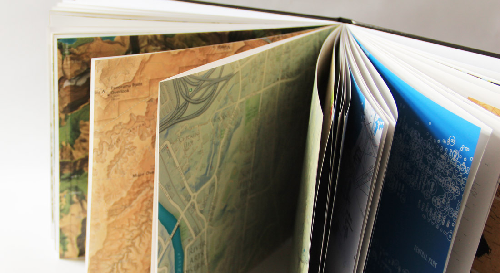

# The Atlas of Design

The Atlas of Design is dedicated to showing off some of the world’s most beautiful and intriguing cartographic design. This is the home for the Atlas of Design website at [*atlasofdesign.org*](http://atlasofdesign.org).



#### The Team

* Alethea Steingisser, Editor
* Lauren Tierney, Editor
* Caroline Rose, Editor

## Installation

This website is created with [Jekyll](https://jekyllrb.com/) and hosted on Github via [Github Pages](https://pages.github.com/). To edit the site you will need to [install Jekyll](https://jekyllrb.com/docs/installation/) and clone this repository. Then you can navigate to the project folder and use Jekyll to generate a site for you.

```bash
gem install jekyll #install jekyll
git clone git@github.com:nacis/atlasofdesign-internal.git #clone the repository
cd atlasofdesign.org #navigate to the new directory
jekyll serve --watch #serves the site at localhost:4000
```

## Add a new post

To add a new blog post you need to add a new file to the `_posts/` directory in this repository. Each post file must be named accordingly: `YYYY-MM-DD-title.md`. You can either add a new post on you computer if you have installed this site locally, otherwise you can [add a new file](https://github.com/nacis/atlasofdesign.org/new/gh-pages/_posts) via Github.com.

Each post requires the following information (YAML) at the top of the file:

```
---
title: "New post title"
layout: post
---

New post content.
```

All posts are written in [Markdown](https://daringfireball.net/projects/markdown/). You can also add HTML!

#### Adding a link

If you add a link, be sure that it starts with 'http://' ...otherwise your browser will just try to append your link to the URL you are already at. 

#### Adding an image

If you are adding a new image to a post or to an existing page on the site, you need to add it to the `img/` directory here or link to it from an external site. Adding a new image looks like this in markdown:

```markdown

```

## Edit a page

Editing the content of a page can happen directly from Github.com if you don't want to clone the repository to your computer. Find the page you want to edit (i.e. the [about page](https://github.com/nacis/atlasofdesign.org/blob/gh-pages/about/index.md)) and select the `pen` icon on the top right of the file, which says "edit this file" when you hover on it. Update the content and then press the "commit changes" button at the bottom.

## License

The Atlas of Design and the contents of the *atlasofdesign.org* are part of and copyright to the [North American Cartographic Information Society](http://nacis.org). Text on the site, unless a quotation from one of our contributors, is licensed according to a [Creative Commons Attribution-NonCommercial-ShareAlike 4.0 International License](http://creativecommons.org/licenses/by-nc-sa/4.0/deed.en_US).

All maps featured in the Atlas of Design, and on the *atlasofdesign.org*, are the intellectual property of their respective creators/copyright holders, and are used with permission. Please contact the copyright holder of the map for inquiries about licensing their work.
